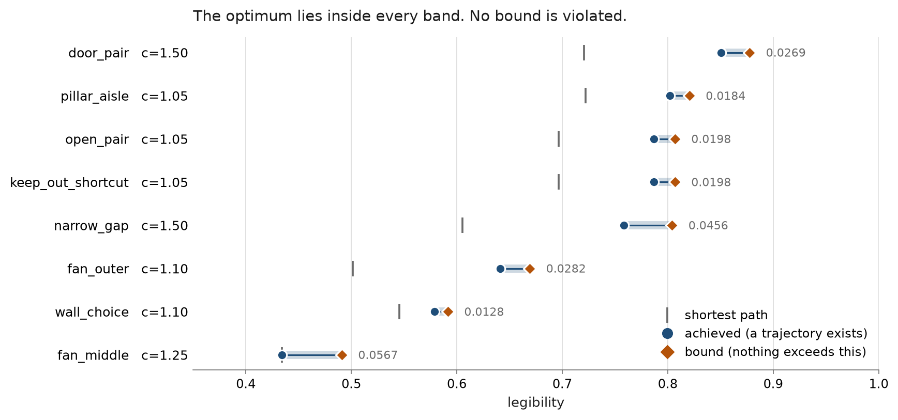
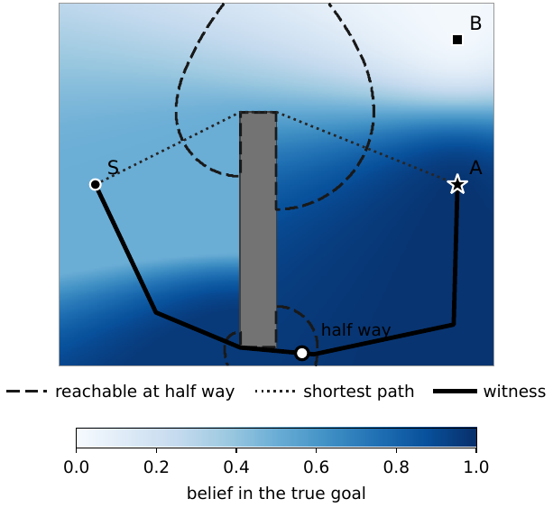
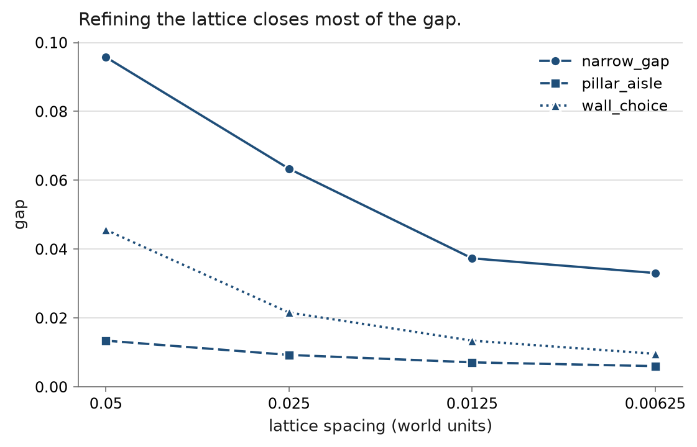

# legibility-bounds

**Certified two-sided bounds on how legible a robot trajectory can be, under a
budget on how much path it may spend.**

Legible motion lets someone watching a robot work out where it is going before
it arrives. Existing methods *optimise* legibility and report the clarity they
found. That is not the same as knowing what is achievable, and it cannot settle
the question a scenario designer actually asks: **is this world hard, or did my
planner just do badly in it?**

This answers that question. For a world, a cost budget and a stated observer,
it returns a trajectory that achieves a legibility, and a bound that no
trajectory within the budget can exceed. The optimum is somewhere between them,
and the distance between them is reported rather than hidden.



Every band above is a certified interval. The circle is a trajectory that
exists; the diamond is a wall nothing can cross. The tick is the shortest path,
for contrast.

---

## What you can say with it

<!-- generated:example -->
> No trajectory from the start to the true goal in `wall_choice`, spending at most 50 per cent more path than the shortest one, attains a legibility of **0.81 or above** under this observer.
>
> One attaining **0.8004** exists.

The shortest path there scores 0.5457, so the budget does buy clarity. The two ends are 0.0064 apart, so any threshold outside that band is decided: above it, unreachable; at or below the achieved value, reached.
<!-- /generated:example -->

The first half of that is the part no search can give you. It is negative, and
it quantifies over **every** trajectory rather than the ones somebody looked
at. No amount of further searching overturns it, and a better optimiser would
not weaken it.

---

## How it works



Shading is the observer's belief in the true goal. Two facts make the problem
tractable, and neither is obvious from the definition of legibility:

1. **The belief is a fixed field.** The distance travelled cancels out of the
   observer's posterior, so belief depends only on *where the robot is*, not on
   how it got there. The whole field can be computed once, before any
   trajectory is considered.
2. **The objective does not see duration.** The time weighting divides by its
   own sum, so total duration cancels. The weighting is over normalised arc
   length, and a bound never has to range over path durations.

The bound then follows from **reachability**. A trajectory of length `L` that
is a fraction `s` of the way along cannot be further than `sL` from the start,
nor further than `(1-s)L` from the goal. That cuts out a lens, drawn dashed
above. Taking the largest belief in each lens bounds every admissible
trajectory at once.

The hard part is obstacles. Two points a millimetre apart either side of a wall
are a wall's length apart in the geodesic metric, so the belief cannot be
bounded over a cell by the usual argument. Writing the belief as **odds against
the true goal** removes the need: bounding it from above needs a lower bound on
a *difference* of cost-to-go values, and the difference is available even when
neither term is.

### The lower end is built, not searched for

A search is exactly what this project exists not to trust, so the lower end is
constructed from the bound's own high-belief cells, threaded together by exact
geodesics, and pulled back towards the shortest path until it fits the budget.
It is then scored by the same metric as everything else, so what it claims is
what it measures.

<!-- generated:witness -->
Against the vendored local search at 500 evaluations, the witness produces the better trajectory in **13 of 32** cases, by up to **0.1485**. Where the search wins, the search's value is used and the row records which produced it.
<!-- /generated:witness -->

---

## Results

<!-- generated:suite -->
| world | obstacles | c | achieved | bound | widest gap | narrowest gap |
| :--- | :--- | ---: | ---: | ---: | ---: | ---: |
| `door_pair` | yes | 1.50 | 0.8507 | 0.8776 | **0.0269** | 0.0066 |
| `fan_middle` | no | 1.25 | 0.4343 | 0.4909 | **0.0567** | 0.0144 |
| `fan_outer` | no | 1.10 | 0.6410 | 0.6692 | **0.0282** | 0.0162 |
| `keep_out_shortcut` | no | 1.05 | 0.7870 | 0.8068 | **0.0198** | 0.0067 |
| `narrow_gap` | yes | 1.50 | 0.7584 | 0.8041 | **0.0456** | 0.0268 |
| `open_pair` | no | 1.05 | 0.7870 | 0.8068 | **0.0198** | 0.0067 |
| `pillar_aisle` | yes | 1.05 | 0.8022 | 0.8205 | **0.0184** | 0.0071 |
| `wall_choice` | yes | 1.10 | 0.5787 | 0.5915 | **0.0128** | 0.0064 |

All 32 world and ceiling pairs, 0 violations. Each row is the world at the ceiling where its interval is widest, with its narrowest gap over all 4 ceilings alongside. Lattice 0.0125, search budget 500.
<!-- /generated:suite -->

---

## What safety costs, certifiably

Keep-out zones are regions a trajectory may enter and is penalised for
entering. The usual way to measure what avoiding them costs is to run two
searches and compare, **which cannot establish that the constraint costs
anything**. A search that did worse under a constraint may simply have been a
worse search.

A keep-out zone constrains the robot but not the observer, so the same argument
bounds the constrained problem. Put that bound beside an unconstrained
trajectory that exists, and the difference is a certified lower bound on the
price of the constraint: something is achievable, and nothing safe can match
it.

<!-- generated:safety -->
| world | c | achievable | safe bound | price of safety |
| :--- | ---: | ---: | ---: | ---: |
| `pillar_aisle` | 1.05 | 0.8022 | 0.7558 | **0.0464** |
| `keep_out_shortcut` | 1.25 | 0.8353 | 0.8225 | **0.0128** |
| `keep_out_shortcut` | 1.10 | 0.8079 | 0.8009 | **0.0070** |

3 of 8 pairs certify a positive price. The rest certify nothing and are reported as nothing.
<!-- /generated:safety -->

In `keep_out_shortcut` the cheapest route is already safe, so the constraint
costs nothing to a robot that does not try to be understood. It is only when
the robot tries to communicate that it has to pay.

---

## Where the remaining width comes from

Two candidates, told apart by measurement rather than argument.

**Not the discarded coupling between samples.** The bound lets each sample sit
anywhere its own lens allows, independently of the others. Restoring that
coupling tightens the widest bound in the suite by less than a hundredth, and
costs more than refining the lattice would.

**Mostly the lattice.**



<!-- generated:refinement -->
| world | 0.05 | 0.025 | 0.0125 | 0.00625 |
| :--- | ---: | ---: | ---: | ---: |
| `narrow_gap` | 0.0958 | 0.0634 | 0.0373 | 0.0331 |
| `pillar_aisle` | 0.0134 | 0.0093 | 0.0071 | 0.0060 |
| `wall_choice` | 0.0456 | 0.0216 | 0.0134 | 0.0096 |

Refining from 0.05 to 0.00625 closes between 55 and 79 per cent of the gap, so the numbers above are conservative by roughly that margin.
<!-- /generated:refinement -->

**And what survives that is the obstacle constant.**

<!-- generated:slack -->
The argument gives `D <= (3 + pi) r`, about 6.14 cell radii. Sampling real points in real cells beside obstacle corners, and measuring to each point's own lattice point, which is the quantity the bound actually uses, finds a worst detour of 0.99, so the constant is loose by a factor of about 6.2. A bound must hold in the worst case and the worst case is rarely met, so this is not an error.

It is also not the prize it was once described as here. Halving this constant, from `(3 + 2pi)` to `(3 + pi)`, closed 1.6 per cent of the suite's total interval width: twenty of the thirty two pairs have no band weight at all and cannot move however tight it becomes. Refining the lattice, which closes 55 to 79 per cent, is worth roughly forty times as much. An earlier version of this file called a sharper constant the highest-leverage improvement outstanding, which the measurement does not support.

Two further corrections went with it. The looseness used to be reported as a factor of 3.7, measured between two arbitrary points of a cell rather than from a point to its own centre. That is a harder quantity than the bound claims, and using it flattered the constant. The sampling also drew offsets from the cell radius, which is the half diagonal, and so covered a box wider than the cell. Corrected for both, no sampled point in any tested world is separated from its own lattice point at all, and the wrapping argument is never needed.

Most of that looseness is not available to anyone, which is a different claim and needs a different kind of evidence. Slack measured against these worlds says how much room there is here. It does not say how much a sharper argument could take. That is bounded by exhibiting a configuration the constant has to survive: a unit cell with a free lattice point at the origin, one convex obstacle, and a point of the cell whose exact geodesic distance to its own lattice point is 3.49 cell radii. No constant below that can hold, so everything available to any future argument is a factor of 1.76, and the rest of the gap belongs to the scenarios rather than to the proof.

That obstacle is 0.86 cell radii wide at its narrowest, so it is thinner than a cell and would have been excluded by the global minimum-width test that `cells_certified` replaced. It passes the per-cell test that is actually in force, which is why it bounds the constant in use rather than the one the withdrawn test assumed. Built by `tools/detour_lower_bound.py`, which decides admissibility with `lattice.cells_certified` and measures with the vendored geodesic rather than reimplementing either.

One thing this does not settle. The supremum is approached as the obstacle nears the lattice point and is not attained, so 3.49 is a lower bound on the sharp constant and not the sharp constant. What that value is remains open.
<!-- /generated:slack -->

---

## Plain-language guide

For a non-specialist reader there is a six-page guide,
[docs/explainer/explainer.pdf](docs/explainer/explainer.pdf), which explains
why searching can never answer the designer's question, how a bound over
every trajectory is possible at all, the odds-against reformulation that
rescues the argument beside obstacles, and what the certified price of
safety means. Its source is committed alongside it and builds with
`latexmk -pdf explainer.tex`.

## Reproducing everything

The exact geometry comes from
[legible-motion-bench](https://github.com/munawarkazmi/legible-motion-bench),
vendored as a submodule and pinned to a commit, so a bound cannot drift from
the benchmark it is bounding.

```bash
git clone --recursive https://github.com/munawarkazmi/legibility-bounds.git
```

```bash
python -m venv .venv && .venv/Scripts/python.exe -m pip install -e ".[dev,figures]"
```

```bash
.venv/Scripts/python.exe -m pytest -q
```

Then any of the tools, each of which writes a record under `results/`:

```bash
.venv/Scripts/python.exe tools/suite_bounds.py
```

| tool | what it produces |
| :--- | :--- |
| `suite_bounds.py` | every world at every ceiling, both ends of each interval |
| `safety_price.py` | the certified price of respecting a keep-out zone |
| `refinement.py` | gap against lattice spacing |
| `detour_slack.py` | how loose the obstacle constant really is |
| `detour_lower_bound.py` | how much of that looseness any argument could take |
| `open_pair_probe.py` | the original kill-criterion probe, on the simplest world |
| `build_paper_tables.py` | the paper's tables and every number quoted in its prose |
| `build_paper_figures.py` | the paper's figure |
| `build_readme.py` | every number in this file |

<!-- generated:commit -->
Pinned geometry: `a376ab2`.
<!-- /generated:commit -->

No number in this README is typed by hand. Everything between a
`<!-- generated:... -->` marker and its closing tag is rewritten from
`results/` by `tools/build_readme.py`, which also has a `--check` mode that
fails if the file has gone stale.

---

## What is not true

This project is careful about what it claims, and these are not footnotes.

- **The observer model is not validated against people.** It is exactly
  reproducible and it has never been shown to match what a human watching the
  robot would infer. Every result is reported at a stated cost ceiling for
  that reason: the founding paper says its model can only be trusted inside
  one.
- **The observer cannot believe in neither goal.** Its posterior sums to one
  over the declared goals however strange the motion becomes. That is a known
  direction of error and it grows with the cost ratio.
- **One formulation.** Legibility is not one thing in this literature. What is
  bounded here is the objective of Dragan, Lee and Srinivasa, and a bound on
  that says nothing about another.
- **A different kind of guarantee.** Learning-based work on legibility carries
  convergence guarantees. Those are about an algorithm reaching what it
  converges to; this is about what any trajectory could achieve.
- **Obstacles must be convex polygons**, and the bound near them rests on a
  precondition, checked per cell, that no obstacle passes clean through a cell
  and no two obstacles meet the same one. A cell that fails it is bounded by
  one, which always holds.
- **One lattice, one observer condition, one search budget.** Nothing here is a
  trend.

---

## Layout

```
legibility_bounds/     the library
  lattice.py             exact geodesic quantities over a lattice of a world
  reachability.py        the bound
  witness.py             the constructed lower end
  anchored.py            a tightening that did not pay, kept as evidence
  visibility.py          whole-lattice visibility, held to the exact predicate
  vendored.py            the one place that knows where the geometry comes from
tools/                 everything that writes a record or a figure
tests/                 62 tests
results/               committed records; every number anywhere comes from here
paper/                 the RA-L draft, its verification log, and its build
vendor/                legible-motion-bench, pinned
```

`STATUS.md` is the working log: what was decided, what was measured, and every
defect found along the way, including the ones that looked like findings first.
